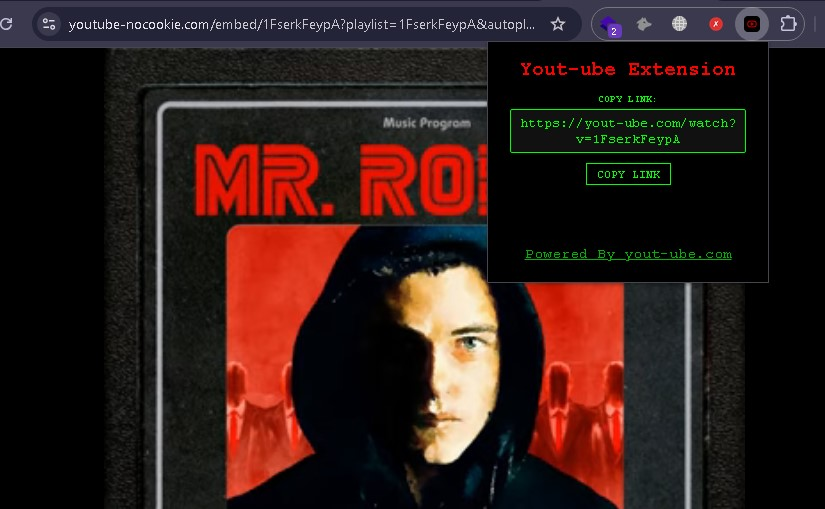

# 🔥 **Yout-ube -- Distraction-Free YouTube Viewer**

[]()
[](LICENSE)

**Yout-ube** is a lightweight browser extension that removes YouTube distractions including ads, comments, and recommended videos to create a **clean, focused viewing experience**.

Minimal. Fast. Ethical.  
Built for **students, researchers, and red team enthusiasts** who value deep focus over noise.

---

## 📸 **Screenshot**



---

## 🧩 **What Yout-ube Does**

- Hides **YouTube ad placeholders** (visual only)
- Removes the **comments section**
- Clears **sidebar recommendations & end screens**
- Optimizes layout for **full-screen learning**
- Works instantly on **youtube.com**
- Runs **entirely in-browser**

Designed for **maximum focus, minimal interference**.

> \* *If configured to use proxy domains (e.g., `yout-ube.com`), see disclaimer below.*

---

## 🛰️ **Tech Stack**

- **Manifest V3** – Latest Chrome Extension API  
- **JavaScript + CSS** – Real-time DOM manipulation  
- **Content Scripts** – Clean UI modifications  
- **Passive UI Filtering** – No network interception or request blocking  

---

## ⚡ **Features**

| Feature                     | Details                                                     |
|----------------------------|-------------------------------------------------------------|
| Ad Element Hiding          | Visually removes ad containers using CSS                    |
| Comment Stripper           | Fully hides comment section                                 |
| Recommendation Cleaner     | Clears sidebar & suggested video panels                     |
| Full-Screen Optimizer      | Auto-focuses on video player                                |
| Local Execution            | All logic runs in your browser, nothing leaves your device  |
| Lightweight                | Under 100KB, no background bloat                            |

---

## 🛠️ Installation

1. **Clone the repository**
   ```bash
   git clone https://github.com/Nuknov/Yout-ube.git
   cd Yout-ube
   1. Open your browser extension page  
   - Chrome: Navigate to chrome://extensions/  
   - Edge: Navigate to edge://extensions/

2. **Enable Developer Mode**  
   - Toggle the switch in the top-right corner

3. **Load the extension**  
   - Click **"Load unpacked"**  
   - Select the `Yout-ube` directory

4. **Pin the extension (optional)**  
   - Click the puzzle icon in the toolbar  
   - Pin **"Yout-ube"**

### Firefox (Temporary Load)
1. Go to `about:debugging#/runtime/this-firefox`  
2. Click **"Load Temporary Add-on"**  
3. Select any file in the repo (e.g., `manifest.json`)

---

## ⚙️ How It Works

Yout-ube uses **client-side DOM manipulation** to:
- Inject CSS rules that hide `.ad-container`, `#comments`, `#related`, etc.
- Remove distracting elements without altering network traffic
- Preserve core YouTube functionality (playback, captions, settings)

✅ **No requests are blocked.**  
✅ **No data is sent externally** (unless optional proxy mode is enabled).

---

## ⚠️ Disclaimer

> This tool is intended solely for **educational, research, and personal productivity purposes**.  
>
> It modifies only the **local appearance** of YouTube pages using browser-side code.  
>
> **Do not use this to bypass content monetization at scale.** Support creators you value.  
>
> If this extension uses **external proxy domains** (e.g., `yout-ube.com`):  
> - That service is **not owned or controlled by the author**  
> - Use at your own risk  
> - Not recommended for sensitive browsing  
>
> The author is **not responsible** for third-party services, data leaks, or misuse.  
> Always comply with [YouTube’s Terms of Service](https://www.youtube.com/t/terms).

---

## 🧠 Use Cases

- Watching cybersecurity tutorials without distraction  
- Studying lectures or conference talks in focus mode  
- Reducing cognitive load during long research sessions  
- Learning ethical browser extension development  
- Simulating clean UI environments for UX research  

Ideal for the **learning phase** where focus drives understanding.

---

## **Author**

**Created by:** [Nuknov](https://github.com/Nuknov)

💡**Powered by:** **[yout-ube.com](https://yout-ube.com)** — Watch YouTube ad-free (without distraction), on loop, in full screen.
